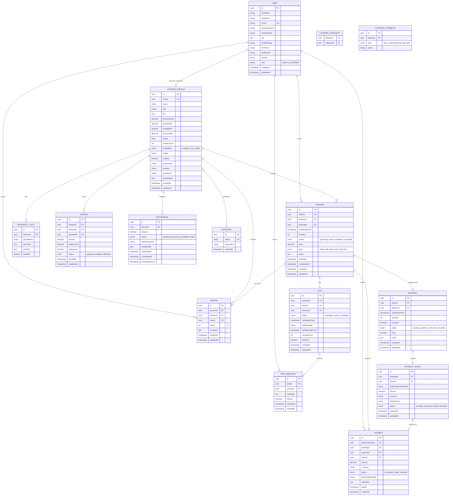

# Entity Relationship Diagram (ERD) for Ottering App

## Database Schema Diagram



---

## Simplified Visual Representation

```
┌─────────────────────────────────────────────────────────────────┐
│                         CORE ENTITIES                            │
└─────────────────────────────────────────────────────────────────┘

┌──────────┐         ┌──────────────────┐         ┌──────────┐
│   USER   │────────▶│ LISTENER_PROFILE │◀────────│ CATEGORY │
│          │ 1:0..1  │                  │ M:N     │          │
└────┬─────┘         └────────┬─────────┘         └──────────┘
     │                        │
     │ 1:N                    │ 1:N
     │                        │
     ▼                        ▼
┌──────────┐         ┌──────────────────┐
│ SESSION  │         │ AVAILABILITY_SLOT│
│          │         │                  │
└────┬─────┘         └──────────────────┘
     │
     │ 1:1
     │
     ▼
┌──────────┐         ┌──────────┐
│   CHAT   │────────▶│ MESSAGE  │
│          │ 1:N     │          │
└──────────┘         └──────────┘

┌─────────────────────────────────────────────────────────────────┐
│                      PAYMENT FLOW                                │
└─────────────────────────────────────────────────────────────────┘

┌──────────┐    ┌────────────────┐    ┌─────────┐    ┌─────────┐
│ BOOKING  │───▶│ PAYMENT_INTENT │───▶│ PAYMENT │───▶│ EARNING │
│          │1:1 │                │1:1 │         │1:1 │         │
└──────────┘    └────────────────┘    └─────────┘    └────┬────┘
                                                           │
                                                           │ N:1
                                                           ▼
                                                      ┌────────────┐
                                                      │ WITHDRAWAL │
                                                      │            │
                                                      └────────────┘

┌─────────────────────────────────────────────────────────────────┐
│                      REVIEW SYSTEM                               │
└─────────────────────────────────────────────────────────────────┘

┌──────────┐         ┌──────────┐
│ SESSION  │────────▶│  REVIEW  │
│          │ 1:0..1  │          │
└──────────┘         └──────────┘
                           ▲
                           │ N:1
                           │
                     ┌─────┴──────┐
                     │   USER     │
                     └────────────┘
```

---

## Entity Details

### 1. **USER** (Core Identity)
- Primary entity for all users (both clients and listeners)
- `role` field determines if user is USER or LISTENER
- One user can optionally become a listener (1:0..1 relationship)

### 2. **LISTENER_PROFILE** (Listener Information)
- Extended profile for users who become listeners
- Links to USER via `userId` foreign key
- Contains pricing, availability, ratings, verification status
- Has many-to-many relationship with CATEGORY

### 3. **CATEGORY** (Service Categories)
- Mental Health, Career Coaching, Relationship Advice, etc.
- Many-to-many with LISTENER_PROFILE via junction table

### 4. **LISTENER_ATTRIBUTE** (Listener Characteristics)
- Stores tone, relationalEnergy, approach as key-value pairs
- Flexible schema for filtering

### 5. **AVAILABILITY_SLOT** (Listener Schedule)
- Weekly recurring availability
- One listener has many slots
- Used for booking scheduling

### 6. **BOOKING** (Booking Request)
- Initial booking request from client
- Creates PAYMENT_INTENT
- Converts to SESSION after payment

### 7. **SESSION** (Actual Meeting)
- The core meeting/conversation entity
- Created from confirmed BOOKING
- Links client and listener
- Has lifecycle: upcoming → active → completed

### 8. **CHAT** (Conversation Thread)
- One-to-one relationship with SESSION
- Contains all messages for that session
- Tracks read/unread status

### 9. **CHAT_MESSAGE** (Individual Messages)
- Messages within a chat
- Sent by either client or listener
- Real-time via WebSocket

### 10. **REVIEW** (Ratings & Feedback)
- Written by client about listener
- Linked to specific SESSION
- Updates listener's overall rating

### 11. **PAYMENT_INTENT** (Payment Initialization)
- Created when booking is made
- Integrates with payment provider (Stripe)
- Holds payment state

### 12. **PAYMENT** (Completed Payment)
- Confirmed payment record
- Links to session and booking
- Triggers earning creation

### 13. **EARNING** (Listener Income)
- Created from successful payment
- Tracks platform fee and net amount
- Status: pending → available → withdrawn

### 14. **WITHDRAWAL** (Payout Request)
- Listener requests to withdraw earnings
- Tracks bank details and status
- Estimated arrival date

---

## Key Relationships

### User → Listener Flow
```
USER (role: USER) 
  → Onboards as listener
  → Creates LISTENER_PROFILE (role: LISTENER)
  → Sets AVAILABILITY_SLOTS
  → Adds CATEGORIES
```

### Booking → Session Flow
```
CLIENT creates BOOKING
  → Creates PAYMENT_INTENT
  → CLIENT confirms PAYMENT
  → BOOKING becomes SESSION
  → SESSION creates CHAT
```

### Session → Review Flow
```
SESSION (status: completed)
  → CLIENT writes REVIEW
  → REVIEW updates LISTENER_PROFILE.rating
  → REVIEW updates LISTENER_PROFILE.reviewCount
```

### Payment → Earning Flow
```
PAYMENT (status: succeeded)
  → Creates EARNING (status: pending)
  → After hold period: EARNING (status: available)
  → LISTENER requests WITHDRAWAL
  → WITHDRAWAL (status: completed)
  → EARNING (status: withdrawn)
```

---

## Indexes for Performance

```sql
-- User lookups
CREATE INDEX idx_user_email ON USER(email);
CREATE INDEX idx_user_role ON USER(role);

-- Listener searches
CREATE INDEX idx_listener_availability ON LISTENER_PROFILE(availability);
CREATE INDEX idx_listener_rating ON LISTENER_PROFILE(rating);
CREATE INDEX idx_listener_verified ON LISTENER_PROFILE(verified);

-- Session queries
CREATE INDEX idx_session_client ON SESSION(clientId);
CREATE INDEX idx_session_listener ON SESSION(listenerId);
CREATE INDEX idx_session_status ON SESSION(status);
CREATE INDEX idx_session_scheduled ON SESSION(scheduledTime);

-- Chat queries
CREATE INDEX idx_chat_client ON CHAT(clientId);
CREATE INDEX idx_chat_listener ON CHAT(listenerId);
CREATE INDEX idx_chat_status ON CHAT(status);

-- Message queries
CREATE INDEX idx_message_chat ON CHAT_MESSAGE(chatId);
CREATE INDEX idx_message_timestamp ON CHAT_MESSAGE(timestamp);

-- Payment queries
CREATE INDEX idx_payment_client ON PAYMENT(clientId);
CREATE INDEX idx_payment_status ON PAYMENT(status);

-- Earning queries
CREATE INDEX idx_earning_listener ON EARNING(listenerId);
CREATE INDEX idx_earning_status ON EARNING(status);
```

---

## Database Constraints

```sql
-- User constraints
ALTER TABLE USER ADD CONSTRAINT uk_user_email UNIQUE(email);
ALTER TABLE USER ADD CONSTRAINT chk_user_role CHECK(role IN ('USER', 'LISTENER'));

-- Listener constraints
ALTER TABLE LISTENER_PROFILE ADD CONSTRAINT fk_listener_user 
  FOREIGN KEY (userId) REFERENCES USER(id) ON DELETE CASCADE;

-- Session constraints
ALTER TABLE SESSION ADD CONSTRAINT fk_session_client 
  FOREIGN KEY (clientId) REFERENCES USER(id);
ALTER TABLE SESSION ADD CONSTRAINT fk_session_listener 
  FOREIGN KEY (listenerId) REFERENCES LISTENER_PROFILE(id);

-- Review constraints
ALTER TABLE REVIEW ADD CONSTRAINT fk_review_session 
  FOREIGN KEY (sessionId) REFERENCES SESSION(id);
ALTER TABLE REVIEW ADD CONSTRAINT fk_review_listener 
  FOREIGN KEY (listenerId) REFERENCES LISTENER_PROFILE(id);
ALTER TABLE REVIEW ADD CONSTRAINT fk_review_user 
  FOREIGN KEY (userId) REFERENCES USER(id);
ALTER TABLE REVIEW ADD CONSTRAINT chk_review_rating 
  CHECK(rating BETWEEN 1 AND 5);

-- Payment constraints
ALTER TABLE PAYMENT ADD CONSTRAINT fk_payment_intent 
  FOREIGN KEY (paymentIntentId) REFERENCES PAYMENT_INTENT(id);
ALTER TABLE PAYMENT ADD CONSTRAINT fk_payment_session 
  FOREIGN KEY (sessionId) REFERENCES SESSION(id);
```

---

## Summary Statistics

| Entity | Primary Keys | Foreign Keys | Relationships |
|--------|--------------|--------------|---------------|
| USER | 1 | 0 | 5 (1:N) |
| LISTENER_PROFILE | 1 | 1 | 8 (1:N, M:N) |
| SESSION | 1 | 3 | 4 (1:1, N:1) |
| CHAT | 1 | 3 | 1 (1:N) |
| PAYMENT | 1 | 4 | 1 (1:1) |
| REVIEW | 1 | 3 | 0 |
| EARNING | 1 | 3 | 1 (N:1) |
| **Total** | **14 entities** | **~40 relationships** | **Complex graph** |

